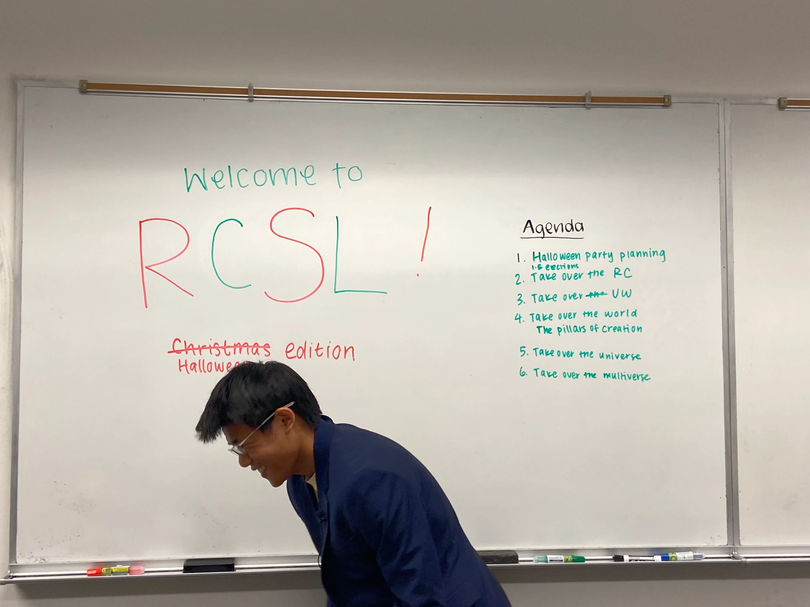
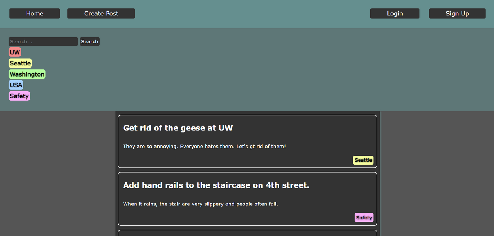

## Fall 2022

The first artefact I'll write about below is a photo from an RSO I lead - RCSL, Robinson Center Student Leadership. The Robinson Center is an organ of the university which allows students from middle school and high school to bypass high school and move straight to university - ever since I chose to enroll in one of its programs, it and the community surrounding it have been a big part of my life. So, I decided to begin giving back, and when given the opportunity during spring of my freshman year to join the largely defunct RCSL and help shape it into something meaningful, I leapt at the chance. RCSL then was composed almost entirely of seniors who were also students in the Robinson Center, and so when they graduated leadership fell to me and another peer who had taken on the opportunity. Over fall quarter, together with my co-premier, I've reorganized RCSL, revitalized its membership base with younger RC students, and organized events. The artefact I chose is a quick snapshot of this - a happy moment from one of our meetings prior to planning an event. Someone snapped a quick photo of me at the whiteboard, just about to begin the meeting, and I retrieved the photo as a memento of the camaraderie and community of the RC and RCSL.

The video is a draft of a piece of music I began composing as an assignment for a class - CSE 490 A1, Philosophy of AI. CSE 490 is a discussion-based class mainly, so it only has one very substantive homework project, a large-scale open-ended creative synthesis of the whole course meant to engage with the variety of presented ideas in novel ways. We could basically take this in any direction we chose, so I, being a composer, chose originally to write a piece of music engaging with AI and creativity. As someone interested in both CS and the whole metaphysics behind being and creativity, I thoroughly benefited from looking at the different perspectives created by the years of polarized discourse around AI. The project is still ongoing, and I've shifted my direction a lot, but this artefact shows what was in my headspace as the project was under way.

<video controls>
  <source src="../images/fuga.mp4" type="video/mp4">
  Your browser does not support the video tag.
</video>

The final photo is a screenshot from a hackathon I had the chance to participate in mid-fall quarter - having never done a hackathon before, it was an intriguing experience, to say the least, and I benefited a lot, learning a great number of practical skills and gaining a lot of value out of working with a team to actually create a software project. The artefact itself is the homepage of the resultant webapp, created almost entirely with technologies I had little to no experience in - React (and JS more generally), Flask, and SQLLite. The project itself was a deeply community-focused idea attempting to bring the flexibility of a platform like Reddit to crowdsourcing community opinions - we ultimately named it Town Hall.

